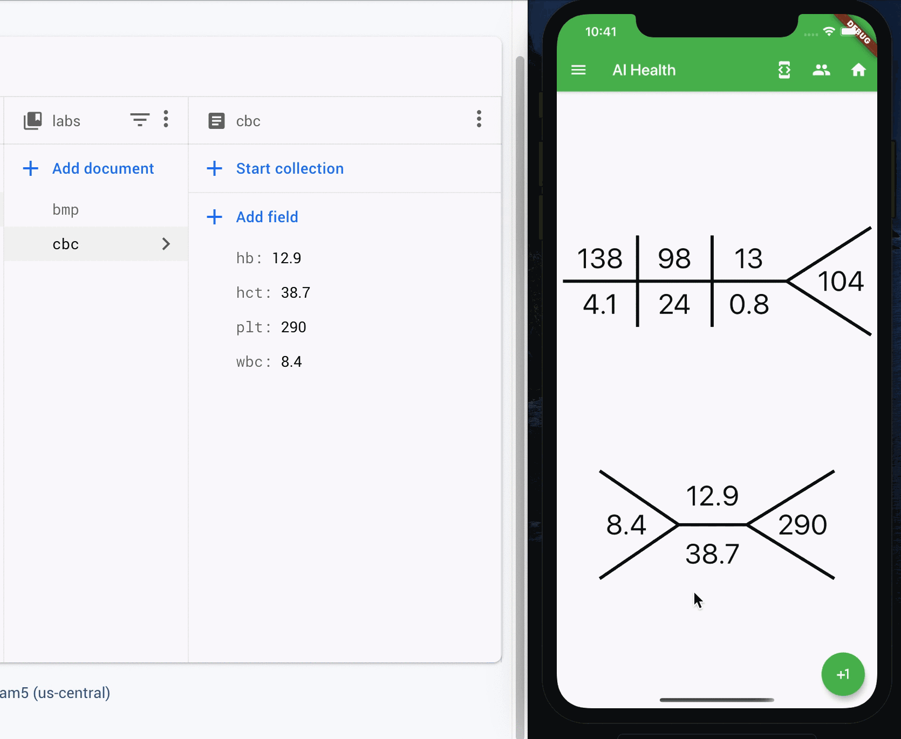

# AI Health Demo

A Flutter health app that connects (fake) laboratory results from [Cloud Firestore][firestore] to a healthcare focused visualization.

Labs displayed are:

* complete blood count (CBC)
* basic metabolic panel (BMP)

## Lab values

Within each lab, only a few results are shown. These are:

### CBC

| Abbr  | Name                   |   Type   |
| :---: | :--------------------- | :------: |
|  wbc  | White blood cell count | _double_ |
|  hb   | Hemoglobin             | _double_ |
|  hct  | Hematocrit             | _double_ |
|  plt  | Platelets              |  _int_   |

### BMP

| Abbr  | Name                |   Type   |
| :---: | :------------------ | :------: |
|  na   | Sodium +            |  _int_   |
|   k   | Potassium +         | _double_ |
|  cl   | Chloride -          |  _int_   |
|  co2  | Bicarbonate -       |  _int_   |
|  bun  | Blood urea nitrogen |  _int_   |
| creat | Creatinine          | _double_ |
|  glc  | Glucose             |  _int_   |

## Getting Started

Watch the video (link to be provided). In GitHub, the master branch corresponds to the final product. Branches also exist for the app as generated during 101 and 102 segments of this lecture.

## Relevant Links

* 101
  * [Dart.dev][dart]
  * [Flutter.dev][flutter]
  * [Multi-device in VS Code][multi-device]
* 102
  * [Drawing Custom Shapes with CustomPainter][custom-painter]
* 103
  * [Pub.dev][pub]
  * [Firebase for Flutter][firebase]
  * [JSON and serialization][json]

showing  dynamically loaded for demonstration at the UT Austin [AI Health Spring 2020 course](https://yingding.ischool.utexas.edu/INF385TAIHealthSpring2020.html)

[firestore]: https://firebase.google.com/docs/firestore
[dart]: https://dart.dev/
[flutter]: https://flutter.dev/
[multi-device]: https://github.com/flutter/flutter/wiki/Multi-device-debugging-in-VS-Code
[custom-painter]: https://zocada.com/drawing-custom-shapes-in-flutter-using-custompainter/
[pub]: https://pub.dev/
[firebase]: https://codelabs.developers.google.com/codelabs/flutter-firebase/#6
[json]: https://flutter.dev/docs/development/data-and-backend/json#serializing-json-using-code-generation-libraries